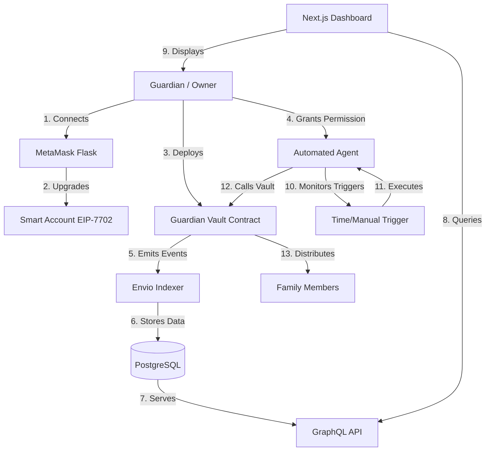

# 🏗️ Guardian Vault Architecture

This document provides a detailed breakdown of the Guardian Vault architecture, data flow, and component interactions.

## 🛰️ System Overview

Guardian Vault is composed of four main layers:
1. **On-Chain Layer**: Smart contracts and Smart Accounts.
2. **Permission Layer**: ERC-7715 Advanced Permissions.
3. **Indexing Layer**: Envio HyperIndex.
4. **Execution Layer**: Automated Agents.

---

## 🔄 Data Flow Diagram

---

## 層 1: On-Chain Layer (Security)
- **GuardianVault.sol**: A secure vault contract that holds ETH and ERC-20 tokens. It maintains a list of beneficiaries and their percentage allocations.
- **EIP-7702 Smart Account**: The owner's account is upgraded to a smart account. This allows the account to sign ERC-7715 permission objects and interact with the vault via delegated agents.

## 層 2: Permission Layer (Delegation)
- **ERC-7715 (Advanced Permissions)**: This layer handles the "Redelegation" of authority. 
- **Permission Object**: A JSON structure signed by the owner that defines:
  - `signer`: The owner's smart account.
  - `permissions`: A list of allowed actions (e.g., `call` to `vaultAddress`).
  - `constraints`: Limits on value, time, and frequency.
- **Storage**: Permissions are stored in the browser's local storage or a secure backend, accessible by the agent.

## 層 3: Indexing Layer (Envio)
- **HyperIndex**: Envio's high-performance indexing engine.
- **Handlers**: TypeScript functions (`src/handlers.ts`) that process raw blockchain events into meaningful entities like `Vault`, `Deposit`, and `Beneficiary`.
- **Global Stats**: A singleton entity that tracks protocol-wide metrics (Total Value Locked, Active Vaults).
- **Real-time Updates**: Envio uses a polling/websocket mechanism to ensure the dashboard reflects the latest block data within seconds.

## 層 4: Execution Layer (Automation)
- **Agents**: Node.js processes that run independently.
- **Workflow**:
  1. Agent retrieves the signed ERC-7715 permission.
  2. Agent monitors the `TriggerSystem` (e.g., checks if the current timestamp > `triggerTimestamp`).
  3. When triggered, the agent constructs a transaction using the permission context.
  4. The agent submits the transaction to the network.
  5. The Vault contract validates the agent's permission and executes the distribution.

---

## 🛠️ Technology Stack
- **Frontend**: Next.js 15, Tailwind CSS, Shadcn/UI.
- **Web3 Libs**: Wagmi, Viem, MetaMask Smart Accounts SDK.
- **Indexing**: Envio (HyperIndex).
- **Blockchain**: Ethereum Sepolia Testnet.
- **Language**: TypeScript.

---

## 🔐 Security Considerations
- **Non-Custodial**: Agents never have access to the owner's private keys.
- **Limited Scope**: Permissions are restricted to specific contracts and functions.
- **Revocability**: The owner can revoke a permission on-chain or by updating the agent's access.
- **Transparency**: Every action taken by an agent is indexed by Envio and visible on the dashboard activity log.
